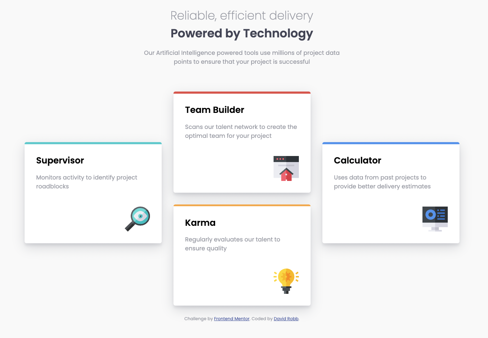

# Frontend Mentor - Four card feature section solution

This is a solution to the [Four card feature section challenge on Frontend Mentor](https://www.frontendmentor.io/challenges/four-card-feature-section-weK1eFYK). Frontend Mentor challenges help you improve your coding skills by building realistic projects.

## Table of contents

- [Frontend Mentor - Four card feature section solution](#frontend-mentor---four-card-feature-section-solution)
  - [Table of contents](#table-of-contents)
  - [Overview](#overview)
    - [The challenge](#the-challenge)
    - [Screenshot](#screenshot)
    - [Links](#links)
  - [My process](#my-process)
    - [Built with](#built-with)
    - [What I learned](#what-i-learned)
    - [Continued development](#continued-development)
  - [Author](#author)
  - [Acknowledgments](#acknowledgments)

## Overview

### The challenge

Users should be able to:

- View the optimal layout for the site depending on their device's screen size

### Screenshot

### Links

- Solution URL: [Github](https://github.com/drobb2020/four-card-feature-section)
- Live Site URL: [Four Card Feature Section](https://superlative-hummingbird-4d3dac.netlify.app/)

## My process

### Built with

- Semantic HTML5 markup
- CSS custom properties
- Flexbox
- Mobile-first workflow

### What I learned

Manipulating the flexbox layout using transform and translateY, as well as using the after pseudo selector.

### Continued development

I plan to get more familiar with both flexbox and grid to better understand how to create layouts.

## Author

- Website - [David Robb](https://davidrobb2021.tech/)
- Frontend Mentor - [@drobb2020](https://www.frontendmentor.io/profile/drobb2020)
- Twitter - [@DavidRobb2](https://www.twitter.com/DavidRobb2)

## Acknowledgments

[Florin Pop](https://www.youtube.com/c/FlorinPop) for presenting a [solution to this challenge](https://www.youtube.com/watch?v=PcSUEo0P0GU&t=2980s) on YouTube.
